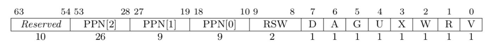

### 1 请列举 SV39 页表页表项的组成，描述其中的标志位有何作用？
在SV39分页模式下，页表项组成如图所示：

其中，Reserved位为保留位，必须与53位内容保持一致，不然页表项无效 [10,53]位为三级页表的44位物理页号 [8,9]是RSW，为内核程序预留，硬件不会对其做任何操作 [0,7]为8位标志位：

V(Valid)：仅当位 V 为 1 时，页表项才是合法的；
R(Read)/W(Write)/X(eXecute)：分别控制索引到这个页表项的对应虚拟页面是否允许读/写/执行；
U(User)：控制索引到这个页表项的对应虚拟页面是否在 CPU 处于 U 特权级的情况下是否被允许访问；
G(Global)：全局位，表示对应的页面是否是全局的。对于 non-leaf PTE，全局设置意味着页表后续级别中的所有映射都是全局的。未能将全局映射标记为全局只会降低性能，而将非全局映射标记为全局则是一个致命错误；
A(Accessed)：处理器记录自从页表项上的这一位被清零之后，页表项的对应虚拟页面是否被访问过；
D(Dirty)：处理器记录自从页表项上的这一位被清零之后，页表项的对应虚拟页面是否被修改过。
### 2 缺页
缺页指的是进程访问页面时页面不在页表中或在页表中无效的现象，此时 MMU 将会返回一个中断， 告知 os 进程内存访问出了问题。os 选择填补页表并重新执行异常指令或者杀死进程。

请问哪些异常可能是缺页导致的？

答：Instruction Page Fault（指令缺页异常）、Load Page Fault（加载缺页异常）、Store Page Fault（存储缺页异常）、Page Table Walk Exception（页表异常）

发生缺页时，描述相关重要寄存器的值，上次实验描述过的可以简略。

scause：保存了缺页异常的原因和类型。 stval：保存了引起缺页异常的访问地址。 sepc：保存了发生中断的指令的地址，可以用于处理中断后继续执行。 sstatus：保存了当前的状态信息，包括当前特权级（SPP）、中断使能（SIE）、浮点数指令设置（FS）等。

缺页有两个常见的原因，其一是 Lazy 策略，也就是直到内存页面被访问才实际进行页表操作。 比如，一个程序被执行时，进程的代码段理论上需要从磁盘加载到内存。但是 os 并不会马上这样做， 而是会保存 .text 段在磁盘的位置信息，在这些代码第一次被执行时才完成从磁盘的加载操作。

这样做有哪些好处？

节约内存开销，不用一开始就把所有内容加载到主存。
加速启动时间，应用启动时需要加载的内容大大减少。
优化资源使用效率，让资源实际使用情况更加贴近实际需求，减少了磁盘和总线之类资源的使用次数。

其实，我们的 mmap 也可以采取 Lazy 策略，比如：一个用户进程先后申请了 10G 的内存空间， 然后用了其中 1M 就直接退出了。按照现在的做法，我们显然亏大了，进行了很多没有意义的页表操作。

处理 10G 连续的内存页面，对应的 SV39 页表大致占用多少内存 (估算数量级即可)？

请简单思考如何才能实现 Lazy 策略，缺页时又如何处理？描述合理即可，不需要考虑实现。

缺页的另一个常见原因是 swap 策略，也就是内存页面可能被换到磁盘上了，导致对应页面失效。

此时页面失效如何表现在页表项(PTE)上？

通过设置页表项特定字段的值，可以使页表项被标记为无效。

### 3 双页表与单页表

为了防范侧信道攻击，我们的 os 使用了双页表。但是传统的设计一直是单页表的，也就是说， 用户线程和对应的内核线程共用同一张页表，只不过内核对应的地址只允许在内核态访问。 (备注：这里的单/双的说法仅为自创的通俗说法，并无这个名词概念，详情见 KPTI )

在单页表情况下，如何更换页表？
和双页表类似，但是单页表情况下，进程的内核栈部分也要映射在同一张页表中。

单页表情况下，如何控制用户态无法访问内核页面？
将内核页面部分页表项设置为失效即可。

单页表有何优势？（回答合理即可）
在响应中断时无需切换地址空间，执行效率更高。

双页表实现下，何时需要更换页表？假设你写一个单页表操作系统，你会选择何时更换页表（回答合理即可）？
在双页表实现下，在响应中断和切换进程时都需要切换页表。单页表操作系统只需在进程切换时切换页表即可。